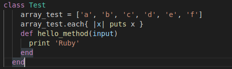
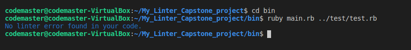
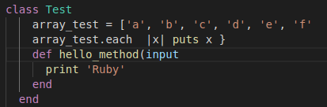
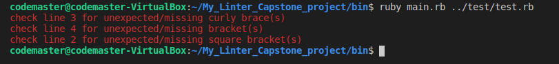

# My_Linter_Capstone_Project
Building Custom Linter.

This custom Linter is built to be able to check for errors in codes within files with specificities for checking brackets/parenthesis, curly braces, and square brackets errors to determine whether they are correctly closed.
## Good code with its linter message.

 
## Poorly written code with the error message using this custom linter.


## Built With
- Ruby
### technology/gem used
- colorize
- Rubocop
- Rspec
### Reqiurements
- Installed Ruby on your local machine(system).
- Basic to intermediate command line skills.
### Setup
- Clone the repository to your local machine first.
- Ensure required colorize and rubocop gems are installed.
### Run Test
Follow these steps on your computer terminal:
- After cloning the Repository, change directory to the project folder by running  ``` cd My_Linter_Capstone_project ``` ( take note of the location of this project on your own machine)
- On project directory then run  ``` gem install colorize ```
- Then change to the bin folder/directory by running ``` cd bin ```
- Run the program by typing ``` ruby main.rb ../test/test.rb ``` into your CLI and press ENTER key (This is to test run how this custom linter is working with test.rb file on this project that contains lines of codes for demonstration )

### Basic instructions on how to use this linter.
 To use this custom linter; 
 1. Navigate to project folder by running ```cd My_Linter_Capstone_project ``` on the CLI.
 2. When you get to the project folder ```then run gem install colorize  ```(to add color to the output message(s)).
 3. Then run ``` cd bin ``` to navigate to bin folder.
 4. On the bin folder type ** ruby main.rb ../file_to_be_tested.rb ** and press ENTER key. The ** file_to_be_tested.rb ** is the ** file's relative path ** (Do not forget to use the file relative path with preceding '../' after ** ruby main.rb ** in this format: ``` ruby main.rb ../file_relative_path ```). It is important that the file to be tested should have .rb extension.
## Author
👤 Adesoji Adewumi
- Github: [@AdesojiCodeMaster](https://github.com/AdesojiCodeMaster)
- Linkedin: [@adesoji-adewumi-7752aba5/](https://www.linkedin.com/in/adesoji-adewumi-7752aba5/)
- Twitter: [@codemas22665735](https://twitter.com/codemas22665735)

## 🤝 Contributing
Suggestions, Contributions and feature requests would be appreciated!
Do not hesitate to make use of the [issues page](https://github.com/AdesojiCodeMaster/My_Linter_Capstone_project/issues).
## Show your support
Give a ⭐️ if you like this project!
## Acknowledgments
- Microverse
- GitHub
- TheOdinProject
## 📝 License
This project is [MIT](LICENSE) licensed.